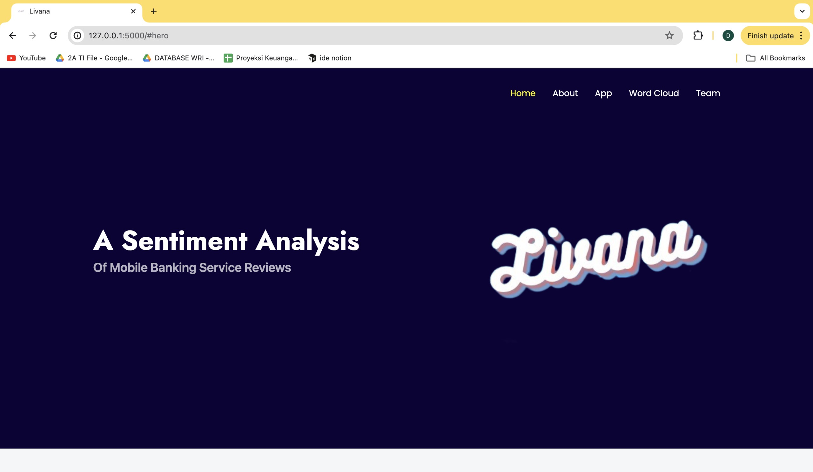
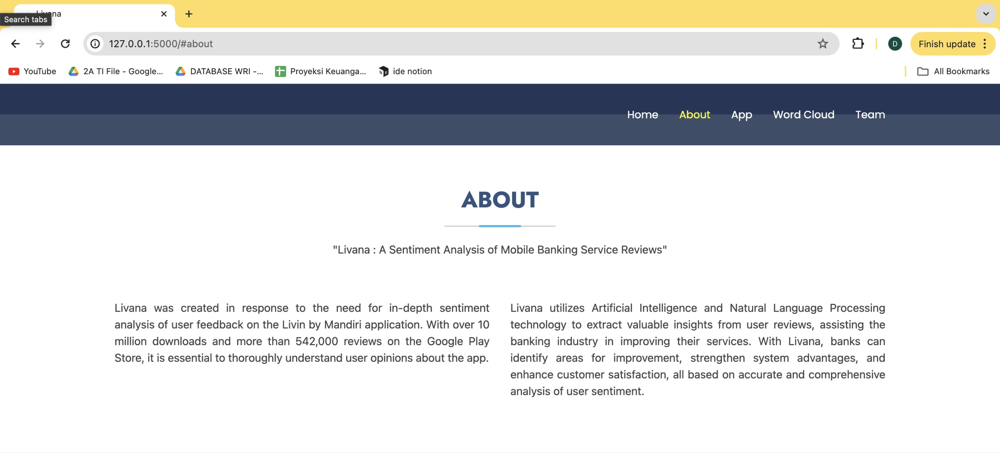
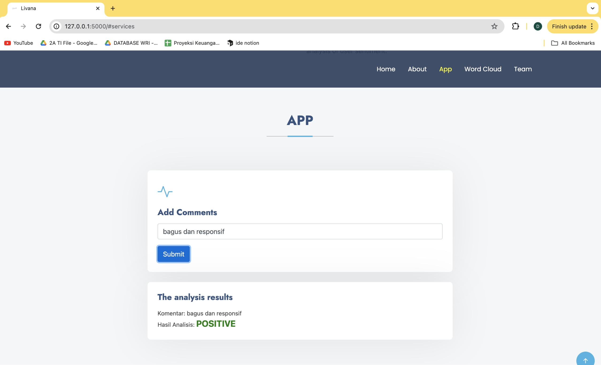
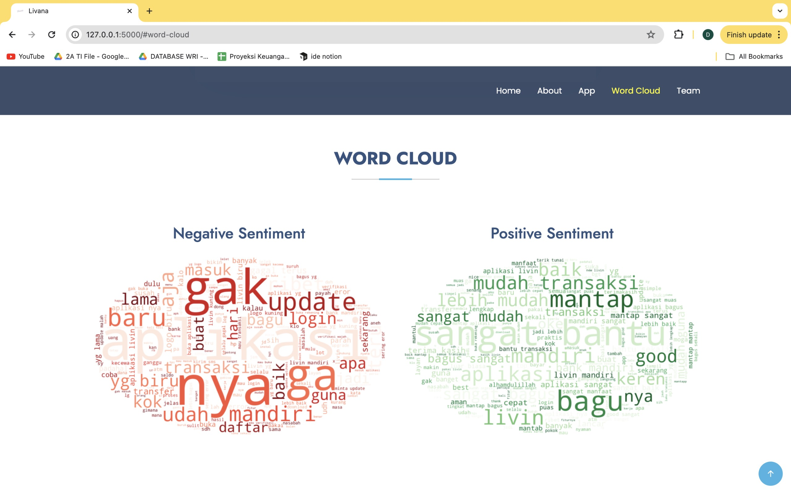

<h1>Livana</h1>
<h4>Livana is a website-based application created with the flask framework to detect sentiment analysis in user feedback so that it can help companies analyze the system's strengths and weaknesses.</h4>

<h2>Home</h2>

- Livana Logo: Located in the header, this logo is the main visual identity of the Livana website.
- In the middle of the home page, there is a large title explaining the meaning of Livana.

<h2>About</h2>

- Project Title: At the top of the page, there is a large title stating the name of the Livana project.
- Background: This section provides information about the reasons for developing the Livana project.
- Goals: This section explains what the Livana project hopes to achieve, as well as the benefits it hopes to provide to users.

<h2>Input</h2>

- Add Comments: In this section, users can enter comments.
- Submit: A button that allows users to submit comments for analysis.
- Analysis results: Once a comment is submitted, analysis results will appear in this section, indicating whether the comment is negative or positive. If the analysis result is positive then the text will be blue (Positive), but if the analysis result is negative then the text will be red (Negative).

<h2>Word Cloud</h2>

- Negative Sentiment Images: Displays a word cloud illustrating words that frequently appear in comments or reviews with negative sentiment.
- Positive Sentiment Images: Displays a word cloud illustrating words that frequently appear in comments or reviews with positive sentiment.

<h2>Team</h2>

- Team Member Profile: This section displays information about each member of the Livana team.
- Role: The role or position of each member in the Livana team.
